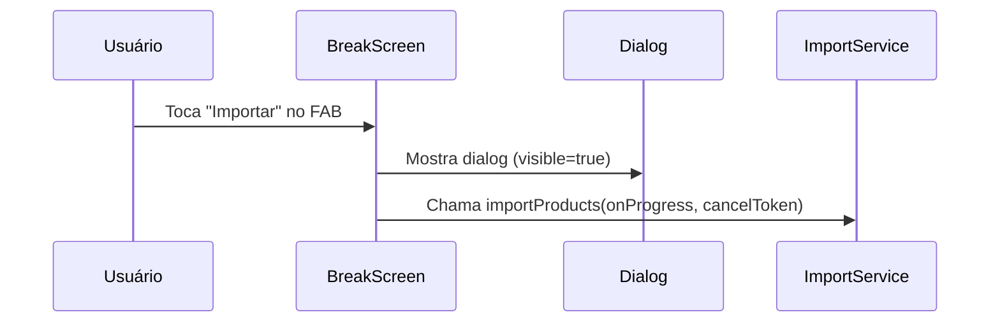
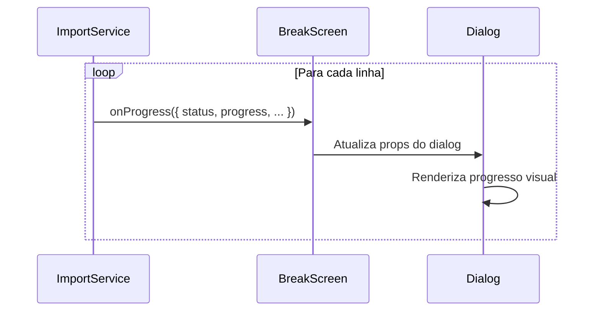
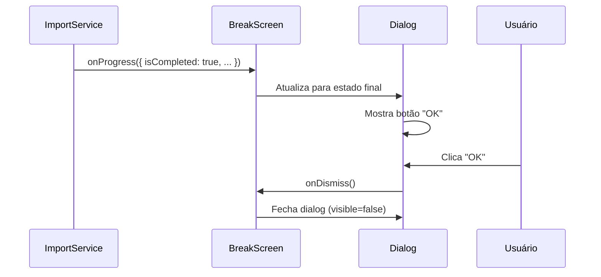

# Implementação do Dialog de Progresso de Importação

## 📋 Visão Geral

Implementação completa de um dialog de progresso para monitorar a importação de arquivos em tempo real, utilizando react-native-paper para consistência visual e seguindo os padrões do projeto.

## 🎯 Arquivos Implementados/Modificados

### 1. **ImportProgressDialog.js** - Componente Dialog
**Arquivo**: [`src/components/dialogs/ImportProgressDialog.js`](src/components/dialogs/ImportProgressDialog.js)

#### Funcionalidades:
- **📊 Barra de Progresso**: ProgressBar visual com percentual
- **📝 Status em Tempo Real**: Mensagens de status atualizadas
- **📄 Nome do Arquivo**: Exibe arquivo sendo processado
- **📈 Contador de Linhas**: "X de Y linhas processadas"
- **❌ Cancelamento**: Botão para cancelar operação
- **✅ Auto-fechamento**: Fecha automaticamente quando concluído
- **🎨 Estados Visuais**: Cores diferentes para sucesso/erro/processamento

#### Props Principais:
```javascript
<ImportProgressDialog
  visible={boolean}              // Controla visibilidade
  onDismiss={function}          // Callback ao fechar
  onCancel={function}           // Callback ao cancelar
  progress={0-1}                // Progresso (0 a 1)
  status={string}               // Mensagem de status
  currentFile={string}          // Nome do arquivo
  processedLines={number}       // Linhas processadas
  totalLines={number}           // Total de linhas
  canCancel={boolean}           // Se pode cancelar
  isCompleted={boolean}         // Se está concluído
  hasError={boolean}            // Se há erro
/>
```

### 2. **ImportService.js** - Suporte a Callbacks
**Arquivo**: [`src/services/ImportService.js`](src/services/ImportService.js)

#### Modificações Implementadas:

##### **Função `processProductFile()` Atualizada:**
```javascript
async processProductFile(asset, onProgress = null, cancelToken = { cancelled: false })
```

**Novos Parâmetros:**
- `onProgress`: Callback para receber atualizações de progresso
- `cancelToken`: Objeto para controlar cancelamento

**Callbacks de Progresso:**
```javascript
onProgress({
  status: 'Processando linha 150 de 500...',
  progress: 0.3,                    // 30%
  processedLines: 150,
  totalLines: 500,
  currentFile: 'PRODUTO.TXT',
  hasError: false
});
```

##### **Função `importProducts()` Atualizada:**
```javascript
async importProducts(onProgress = null, cancelToken = { cancelled: false })
```

**Funcionalidades Adicionadas:**
- ✅ Callbacks de progresso em tempo real
- ✅ Suporte ao cancelamento via token
- ✅ Não exibe Alert quando há callback (UI customizada)
- ✅ Retorna status de cancelamento

### 3. **BreakScreen.js** - Integração Completa
**Arquivo**: [`src/screens/BreakScreen.js`](src/screens/BreakScreen.js)

#### Estados Adicionados:
```javascript
// Estados para o dialog de progresso
const [importDialogVisible, setImportDialogVisible] = useState(false);
const [importProgress, setImportProgress] = useState({
  progress: 0,
  status: 'Preparando importação...',
  currentFile: '',
  processedLines: 0,
  totalLines: 0,
  isCompleted: false,
  hasError: false,
  canCancel: true
});
const cancelTokenRef = useRef({ cancelled: false });
```

#### Funções Implementadas:

##### **handleImport() Atualizada:**
- Exibe dialog de progresso
- Passa callback para ImportService
- Atualiza estado em tempo real
- Trata conclusão e erros

##### **handleCancelImport():**
```javascript
const handleCancelImport = () => {
  cancelTokenRef.current.cancelled = true;
  setImportProgress(prev => ({
    ...prev,
    status: 'Cancelando importação...',
    canCancel: false
  }));
};
```

##### **handleDismissImportDialog():**
```javascript
const handleDismissImportDialog = () => {
  setImportDialogVisible(false);
  // Reset do estado após fechar
  setTimeout(() => {
    setImportProgress({ /* estado inicial */ });
  }, 300);
};
```

## 🎬 Fluxo de Funcionamento

### 1. **Iniciação**


### 2. **Processamento**


### 3. **Conclusão**


## 🎨 Estados Visuais do Dialog

### **🔄 Processando**
- **Título**: "📥 Importando Produtos"
- **Cor**: Primary
- **Botão**: "Cancelar" (vermelho)
- **Barra**: Azul progressiva

### **✅ Sucesso**
- **Título**: "✅ Importação Concluída"
- **Cor**: Primary
- **Botão**: "OK" (azul)
- **Barra**: 100% azul

### **❌ Erro**
- **Título**: "❌ Erro na Importação"
- **Cor**: Error (vermelho)
- **Botão**: "OK" (azul)
- **Barra**: Vermelha

### **⏹️ Cancelado**
- **Título**: "⏹️ Importação Cancelada"
- **Status**: "Cancelando importação..."
- **Botão**: Nenhum (temporário)

## 📊 Exemplos de Uso

### **Estado Inicial:**
```javascript
{
  status: 'Selecionando arquivo...',
  progress: 0,
  processedLines: 0,
  totalLines: 0,
  currentFile: ''
}
```

### **Durante Processamento:**
```javascript
{
  status: 'Processando linha 250 de 1000...',
  progress: 0.25,
  processedLines: 250,
  totalLines: 1000,
  currentFile: 'PRODUTO.TXT'
}
```

### **Concluído com Sucesso:**
```javascript
{
  status: '✅ Importação concluída! 150 criados, 75 atualizados',
  progress: 1,
  processedLines: 1000,
  totalLines: 1000,
  isCompleted: true,
  canCancel: false
}
```

### **Erro:**
```javascript
{
  status: '❌ Erro: Arquivo corrompido na linha 456',
  progress: 0.456,
  processedLines: 456,
  totalLines: 1000,
  hasError: true,
  isCompleted: true,
  canCancel: false
}
```

## 🔧 Funcionalidades Implementadas

### ✅ **Monitoramento em Tempo Real**
- Progresso atualizado a cada 10 linhas processadas
- Status descritivo do que está acontecendo
- Contador de linhas processadas vs total

### ✅ **Cancelamento Robusto**
- Token compartilhado entre UI e Service
- Verificação de cancelamento a cada linha
- Estado "cancelando" para feedback visual

### ✅ **Tratamento de Erros**
- Captura erros por linha individualmente
- Exibe erro específico no dialog
- Mantém estatísticas de erros

### ✅ **Auto-fechamento Inteligente**
- Permanece aberto durante processamento
- Fecha automaticamente quando cancelado
- Botão OK apenas quando concluído/erro

### ✅ **Design Responsivo**
- Utiliza react-native-paper para consistência
- Cores temáticas do projeto
- Animações suaves

## 🚀 Benefícios da Implementação

### **1. UX Melhorada**
- **Feedback Visual**: Usuário vê progresso em tempo real
- **Controle**: Pode cancelar operação a qualquer momento
- **Informações Claras**: Status, arquivo, progresso numérico

### **2. Robustez**
- **Cancelamento Seguro**: Interrompe transação do banco
- **Tratamento de Erros**: Não trava a interface
- **Estados Consistentes**: Sempre mostra informação correta

### **3. Performance**
- **Callbacks Otimizados**: Atualiza a cada 10 linhas (não toda linha)
- **Operações Não-bloqueantes**: UI permanece responsiva
- **Gerenciamento de Memória**: Reset de estados após uso

### **4. Manutenibilidade**
- **Componente Reutilizável**: Pode ser usado em outras telas
- **Props Configuráveis**: Adapta-se a diferentes cenários
- **Padrões Consistentes**: Segue arquitetura do projeto

## 🔮 Extensões Futuras

### **Possíveis Melhorias:**
- [ ] **Preview de Dados**: Mostrar primeiras linhas antes de importar
- [ ] **Histórico de Progresso**: Salvar logs de importações
- [ ] **Estimativa de Tempo**: Calcular tempo restante
- [ ] **Resumo Detalhado**: Mostrar estatísticas completas no final
- [ ] **Importação por Chunks**: Processar em lotes para arquivos grandes
- [ ] **Retry Automático**: Tentar novamente em caso de erro temporário

A implementação está **completa e funcional**, proporcionando uma experiência de usuário profissional para operações de importação de dados! 🎉