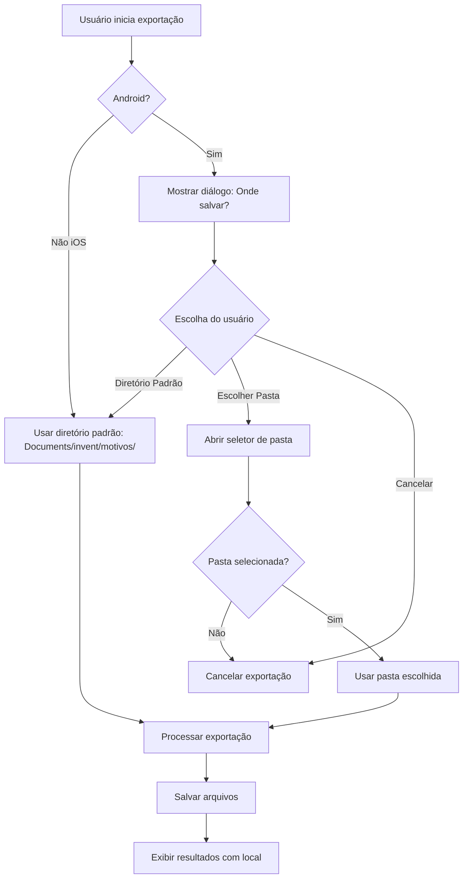

# Plano de Implementação - Modificações no ExportService

## Objetivo
Implementar as seguintes modificações no ExportService:
1. Atualizar `createReasonDirectory()` para usar `Documents/<nome_do_app>/motivos/motivoXX/`
2. Implementar detecção automática do nome da aplicação
3. Utilizar expo-document-picker para seleção dinâmica de diretório pelo usuário
4. Remover especificação de diretório fixo na escolha do usuário

## Análise do Estado Atual

### Nome da Aplicação
- **Arquivo**: `app.json`
- **Nome detectado**: `"invent"`
- **Versão**: `"v1.0.5"`

### Estrutura Atual vs Nova Estrutura
```
# ATUAL
Documents/inventario/motivos/motivo01/

# NOVA
Documents/invent/motivos/motivo01/
```

## Modificações Detalhadas

### 1. Detecção Automática do Nome da Aplicação

**Arquivo**: `src/services/ExportService.js`
**Localização**: Adicionar no início da classe

```javascript
import appConfig from '../../app.json';

class ExportService {
  /**
   * Obtém o nome da aplicação do app.json
   * @returns {string} - Nome da aplicação
   */
  getAppName() {
    return appConfig.expo?.name || 'app';
  }
```

### 2. Atualização da função `createBaseDirectories()`

**Localização**: Linhas 151-177 do arquivo atual

```javascript
/**
 * Criar estrutura base de diretórios usando nome dinâmico da aplicação
 */
async createBaseDirectories() {
  try {
    const documentsDir = FileSystem.documentDirectory;
    const appName = this.getAppName();
    const baseDir = `${documentsDir}${appName}/`;
    const motivosDir = `${baseDir}motivos/`;
    
    // Verificar e criar diretório da aplicação
    const baseDirInfo = await FileSystem.getInfoAsync(baseDir);
    if (!baseDirInfo.exists) {
      await FileSystem.makeDirectoryAsync(baseDir, { intermediates: true });
      console.log(`EXPORT_SERVICE: Diretório ${appName}/ criado`);
    }
    
    // Verificar e criar diretório motivos
    const motivosDirInfo = await FileSystem.getInfoAsync(motivosDir);
    if (!motivosDirInfo.exists) {
      await FileSystem.makeDirectoryAsync(motivosDir, { intermediates: true });
      console.log('EXPORT_SERVICE: Diretório motivos/ criado');
    }
    
    return motivosDir;
    
  } catch (error) {
    console.error('EXPORT_SERVICE: Erro ao criar diretórios base:', error);
    throw new Error(`Falha ao criar estrutura de diretórios: ${error.message}`);
  }
}
```

### 3. Atualização da função `createReasonDirectory()`

**Localização**: Linhas 249-266 do arquivo atual

```javascript
/**
 * Criar diretório específico do motivo usando nome dinâmico da aplicação
 */
async createReasonDirectory(reasonCode) {
  try {
    const documentsDir = FileSystem.documentDirectory;
    const appName = this.getAppName();
    const reasonDir = `${documentsDir}${appName}/motivos/motivo${reasonCode.padStart(2, '0')}/`;
    
    const dirInfo = await FileSystem.getInfoAsync(reasonDir);
    if (!dirInfo.exists) {
      await FileSystem.makeDirectoryAsync(reasonDir, { intermediates: true });
      console.log(`EXPORT_SERVICE: Diretório motivo${reasonCode.padStart(2, '0')}/ criado`);
    }
    
    return reasonDir;
    
  } catch (error) {
    console.error(`EXPORT_SERVICE: Erro ao criar diretório do motivo ${reasonCode}:`, error);
    throw error;
  }
}
```

### 4. Implementação de Seleção Dinâmica de Diretório

**Nova função**: Adicionar após `createReasonDirectory()`

```javascript
/**
 * Permite ao usuário escolher diretório de destino usando DocumentPicker
 * @returns {Promise<string|null>} - URI do diretório escolhido ou null se cancelado
 */
async selectExportDirectory() {
  try {
    if (Platform.OS === 'android') {
      const permissions = await FileSystem.StorageAccessFramework.requestDirectoryPermissionsAsync();
      if (permissions.granted) {
        console.log('EXPORT_SERVICE: Diretório de destino escolhido pelo usuário:', permissions.directoryUri);
        return permissions.directoryUri;
      } else {
        console.log('EXPORT_SERVICE: Usuário cancelou seleção de diretório');
        return null;
      }
    } else {
      // Para iOS, usar diretório padrão da aplicação
      return await this.createBaseDirectories();
    }
  } catch (error) {
    console.error('EXPORT_SERVICE: Erro ao selecionar diretório:', error);
    throw new Error(`Falha na seleção do diretório: ${error.message}`);
  }
}
```

### 5. Atualização da função `exportData()`

**Localização**: Linhas 64-146 do arquivo atual

```javascript
/**
 * Realizar exportação completa de dados com seleção dinâmica de diretório
 */
async exportData() {
  console.log('EXPORT_SERVICE: Iniciando exportação de dados...');
  
  let baseDirectoryUri = null;
  let useDefaultStructure = true;

  // Perguntar ao usuário onde salvar (apenas Android)
  if (Platform.OS === 'android') {
    try {
      // Mostrar opções ao usuário
      const userChoice = await new Promise((resolve) => {
        Alert.alert(
          'Escolher Local de Exportação',
          'Onde você gostaria de salvar os arquivos?',
          [
            {
              text: 'Diretório Padrão',
              onPress: () => resolve('default'),
              style: 'default'
            },
            {
              text: 'Escolher Pasta',
              onPress: () => resolve('custom'),
              style: 'default'
            },
            {
              text: 'Cancelar',
              onPress: () => resolve('cancel'),
              style: 'cancel'
            }
          ]
        );
      });

      if (userChoice === 'cancel') {
        return {
          totalReasons: 0,
          successfulExports: 0,
          failedExports: 0,
          exportedFiles: [],
          errors: [{ reason: 'N/A', error: 'Exportação cancelada pelo usuário.' }]
        };
      }

      if (userChoice === 'custom') {
        baseDirectoryUri = await this.selectExportDirectory();
        if (!baseDirectoryUri) {
          return {
            totalReasons: 0,
            successfulExports: 0,
            failedExports: 0,
            exportedFiles: [],
            errors: [{ reason: 'N/A', error: 'Seleção de diretório cancelada.' }]
          };
        }
        useDefaultStructure = false;
      }
    } catch (err) {
      console.error('EXPORT_SERVICE: Erro ao solicitar opções de diretório:', err);
      Alert.alert('Erro', `Erro ao configurar exportação: ${err.message}`);
      return {
        totalReasons: 0,
        successfulExports: 0,
        failedExports: 0,
        exportedFiles: [],
        errors: [{ reason: 'N/A', error: `Falha na configuração: ${err.message}` }]
      };
    }
  }

  // Se usando estrutura padrão e não foi selecionado diretório customizado
  if (useDefaultStructure && !baseDirectoryUri) {
    await this.createBaseDirectories();
  }

  try {
    const reasons = await ReasonService.getAllReasons();
    if (!reasons || reasons.length === 0) {
      throw new Error('Nenhum motivo encontrado no banco de dados');
    }
    console.log(`EXPORT_SERVICE: ${reasons.length} motivos encontrados`);

    const results = {
      totalReasons: reasons.length,
      successfulExports: 0,
      failedExports: 0,
      exportedFiles: [],
      errors: []
    };

    for (const reason of reasons) {
      try {
        const exported = await this.exportReasonData(reason, baseDirectoryUri, useDefaultStructure);
        if (exported) {
          results.successfulExports++;
          results.exportedFiles.push(exported);
        }
      } catch (error) {
        console.error(`EXPORT_SERVICE: Erro ao exportar motivo ${reason.code}:`, error);
        results.failedExports++;
        results.errors.push({
          reason: reason.code,
          error: error.message
        });
      }
    }

    this.showExportResults(results);
    return results;

  } catch (error) {
    console.error('EXPORT_SERVICE: Erro na exportação:', error);
    Alert.alert(
      'Erro na Exportação',
      `Ocorreu um erro durante a exportação: ${error.message}`,
      [{ text: 'OK' }]
    );
    throw error;
  }
}
```

### 6. Atualização da função `exportReasonData()`

**Localização**: Linhas 182-244 do arquivo atual

```javascript
/**
 * Exportar dados de um motivo específico com suporte a diretório customizado
 */
async exportReasonData(reason, baseDirectoryUri = null, useDefaultStructure = true) {
  try {
    console.log(`EXPORT_SERVICE: Processando motivo ${reason.code} - ${reason.description}`);
    
    const allEntries = await EntryService.getUnsyncedEntries();
    const entries = allEntries.filter(entry => entry.reason_id === reason.id);
    
    if (!entries || entries.length === 0) {
      console.log(`EXPORT_SERVICE: Nenhuma entrada pendente para motivo ${reason.code}`);
      return null;
    }
    
    console.log(`EXPORT_SERVICE: ${entries.length} entradas encontradas para motivo ${reason.code}`);
    
    const consolidatedEntries = await this.consolidateEntries(entries);
    console.log(`EXPORT_SERVICE: ${consolidatedEntries.length} produtos únicos após consolidação`);
    
    const fileName = this.generateFileName(reason.code);
    const fileContent = await this.generateFileContent(consolidatedEntries);
    
    let finalFilePathForLog = '';

    if (Platform.OS === 'android' && baseDirectoryUri && !useDefaultStructure) {
      // Usar diretório customizado escolhido pelo usuário
      const fileUri = await FileSystem.StorageAccessFramework.createFileAsync(
        baseDirectoryUri,
        fileName,
        'text/plain'
      );
      await FileSystem.writeAsStringAsync(fileUri, fileContent, {
        encoding: FileSystem.EncodingType.UTF8
      });
      finalFilePathForLog = fileUri;
    } else {
      // Usar estrutura de diretórios padrão da aplicação
      const reasonDir = await this.createReasonDirectory(reason.code);
      const filePath = `${reasonDir}${fileName}`;
      await FileSystem.writeAsStringAsync(filePath, fileContent, {
        encoding: FileSystem.EncodingType.UTF8
      });
      finalFilePathForLog = filePath;
    }
    
    console.log(`EXPORT_SERVICE: Arquivo criado: ${finalFilePathForLog}`);
    
    // Marcar entradas como sincronizadas
    for (const entry of entries) {
      try {
        await EntryService.markAsSynced(entry.id);
      } catch (error) {
        console.error(`EXPORT_SERVICE: Erro ao marcar entrada ${entry.id} como sincronizada:`, error);
      }
    }
    
    return {
      reason: reason.code,
      fileName,
      filePath: finalFilePathForLog,
      entriesCount: consolidatedEntries.length,
      useDefaultStructure
    };
    
  } catch (error) {
    console.error(`EXPORT_SERVICE: Erro ao exportar motivo ${reason.code}:`, error);
    throw new Error(`Falha na exportação do motivo ${reason.code}: ${error.message}`);
  }
}
```

### 7. Atualização da função `generateFileName()`

**Localização**: Linhas 272-286 do arquivo atual

```javascript
/**
 * Gerar nome do arquivo com padrão motivoXX_YYYYMMDD.txt (sem hora/minuto/segundo)
 */
generateFileName(reasonCode) {
  const now = new Date();
  const year = now.getFullYear();
  const month = String(now.getMonth() + 1).padStart(2, '0');
  const day = String(now.getDate()).padStart(2, '0');
  
  const dateStr = `${year}${month}${day}`;
  const paddedCode = reasonCode.padStart(2, '0');
  
  return `motivo${paddedCode}_${dateStr}.txt`;
}
```

### 8. Atualização da função `showExportResults()`

**Localização**: Linhas 344-400 do arquivo atual

```javascript
/**
 * Exibir resultados da exportação com informações sobre local de salvamento
 */
showExportResults(results) {
  const { totalReasons, successfulExports, failedExports, exportedFiles, errors } = results;
  
  if (successfulExports === 0 && failedExports === 0) {
    Alert.alert(
      'Exportação Concluída',
      'Nenhuma entrada pendente encontrada para exportação.',
      [{ text: 'OK' }]
    );
    return;
  }
  
  let message = `Exportação concluída!\n\n`;
  message += `• Motivos processados: ${totalReasons}\n`;
  message += `• Exportações bem-sucedidas: ${successfulExports}\n`;
  
  if (failedExports > 0) {
    message += `• Falhas: ${failedExports}\n`;
  }
  
  if (exportedFiles.length > 0) {
    message += `\nArquivos gerados:\n`;
    exportedFiles.forEach(file => {
      let fileInfo = `• ${file.fileName} (${file.entriesCount} entradas)`;
      if (file.errorsCount > 0) {
        fileInfo += ` - ${file.errorsCount} avisos`;
      }
      message += fileInfo + '\n';
      
      // Exibir avisos específicos do arquivo se houver
      if (file.errors && file.errors.length > 0) {
        file.errors.forEach(error => {
          message += `    - ${error}\n`;
        });
      }
    });
  }
  
  if (errors.length > 0) {
    message += `\nErros gerais:\n`;
    errors.forEach(error => {
      message += `• Motivo ${error.reason}: ${error.error}\n`;
    });
  }
  
  // Informar sobre local de salvamento
  if (exportedFiles.length > 0) {
    const firstFile = exportedFiles[0];
    if (Platform.OS === 'android' && !firstFile.useDefaultStructure) {
      message += `\nArquivos salvos no diretório escolhido pelo usuário`;
    } else {
      const appName = this.getAppName();
      message += `\nArquivos salvos em: Documentos/${appName}/motivos/`;
    }
  }
  
  Alert.alert(
    successfulExports > 0 ? 'Exportação Realizada' : 'Exportação com Problemas',
    message,
    [{ text: 'OK' }]
  );
}
```

## Imports Necessários

**Localização**: Início do arquivo, adicionar:

```javascript
import appConfig from '../../app.json';
```

## Benefícios das Modificações

### 1. Flexibilidade de Diretório
- **Usuário pode escolher**: Local personalizado ou padrão da aplicação
- **Multiplataforma**: Funciona diferente no Android (seleção) e iOS (padrão)

### 2. Nome Dinâmico da Aplicação
- **Configurável**: Baseado no `app.json`
- **Futuro-prova**: Se mudar nome da app, diretórios seguem automaticamente

### 3. Estrutura Organizada
```
Documents/
└── invent/
    └── motivos/
        ├── motivo01/
        │   ├── motivo01_20240601.txt
        │   └── motivo01_20240602.txt
        ├── motivo02/
        │   └── motivo02_20240601.txt
        └── motivo03/
            └── motivo03_20240603.txt
```

### 4. UX Melhorada
- **Opções claras**: Diálogo pergunta onde salvar
- **Feedback detalhado**: Informa onde arquivos foram salvos
- **Cancelamento**: Usuário pode cancelar a qualquer momento

## Fluxo de Experiência do Usuário



## Testes Recomendados

### 1. Teste de Diretórios
- [ ] Criação automática de `Documents/invent/motivos/motivoXX/`
- [ ] Detecção correta do nome da aplicação do `app.json`
- [ ] Funcionamento em Android e iOS

### 2. Teste de Seleção de Diretório
- [ ] Diálogo de opções aparece corretamente no Android
- [ ] Seleção de pasta customizada funciona
- [ ] Cancelamento funciona em todas as etapas

### 3. Teste de Nomenclatura
- [ ] Arquivos gerados com formato `motivoXX_YYYYMMDD.txt`
- [ ] Sem duplicação de hora/minuto/segundo no nome

### 4. Teste de Mensagens
- [ ] Feedback correto sobre local de salvamento
- [ ] Mensagens claras sobre sucesso/erro

## Próximos Passos

1. **Implementar as modificações** no arquivo `src/services/ExportService.js`
2. **Testar em dispositivo Android** para verificar seleção de diretório
3. **Testar em iOS** para verificar comportamento padrão
4. **Validar estrutura de diretórios** criada automaticamente
5. **Verificar feedback ao usuário** sobre local dos arquivos salvos

## Compatibilidade

### Mantida
- ✅ Estrutura existente de consolidação de entradas
- ✅ Formatação de arquivos de exportação
- ✅ Marcação de sincronização
- ✅ Tratamento de erros

### Melhorada
- 🔄 Estrutura de diretórios mais organizada
- 🔄 Flexibilidade na escolha do local de salvamento
- 🔄 Nome dinâmico da aplicação
- 🔄 UX mais intuitiva

### Removida
- ❌ Diretório fixo `inventario/`
- ❌ Timestamp com hora/minuto/segundo no nome do arquivo