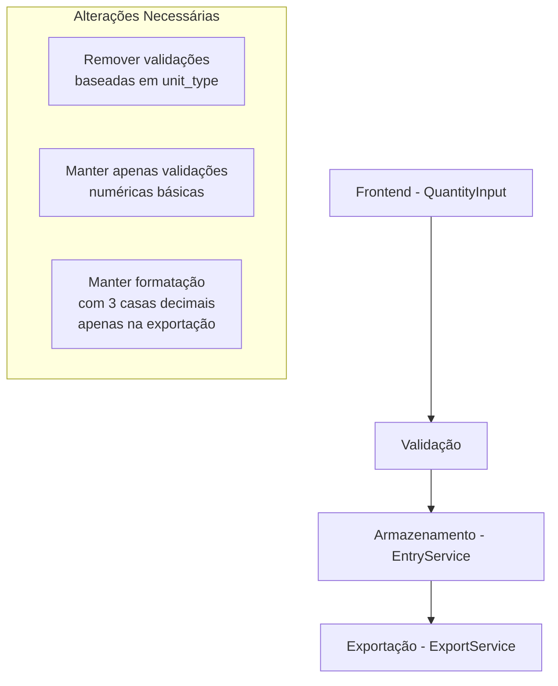

# Plano de Remoção de Validação Unit Type

## Objetivo

Remover validações no frontend que restrinjam a entrada de quantidades com base na coluna `unit_type`, permitindo que o usuário tenha total liberdade para decidir se a quantidade será registrada como quilo (`KG`) ou unidade (`UN`).



## Implementação

### 1. Componente QuantityInput (src/components/forms/QuantityInput.js)

- Implementar seletor de tipo de unidade:
  - Botão para alternar entre KG e UN
  - Tipo selecionável independente do unit_type do produto
  - Limpa o valor ao trocar o tipo para evitar inconsistências

- Máscaras de formatação por tipo selecionado:
  - Quando KG selecionado:
    - Formato "00.00" com duas casas decimais
    - Aceita valores entre 0.01 e 9999.99
    - Mostra placeholder "00.00"
  - Quando UN selecionado:
    - Formato "####" para valores inteiros
    - Aceita valores entre 1 e 9999
    - Mostra placeholder "####"
    
- Layout:
  - Campo de entrada com máscara específica
  - Botão de alternância KG/UN ao lado
  - Estilo flexível adaptável ao container

### 2. Serviço de Exportação (src/services/ExportService.js)

- Simplificar método `formatQuantity`:
  - Manter apenas validações essenciais:
    - Números inválidos ou negativos
    - Valores zero
    - Valores acima de 9999.99
  - Normalizar todos os números para 3 casas decimais na exportação
  - Exemplos de formatação:
    - `1` → `1.000`
    - `0.5` → `0.500`
    - `33.45` → `33.450`
    - `9.99` → `9.990`

### 3. Serviço de Entradas (src/services/EntryService.js)

- Manter armazenamento como `number` sem formatação
- Garantir consistência dos dados:
  - KG: armazenar valor decimal original
  - UN: armazenar valor inteiro

## Validação

1. Testes de Entrada para KG:
   - Aceitar valores decimais: `0.01` a `9999.99`
   - Formatar com duas casas: `1.50`, `33.45`
   - Rejeitar mais de duas casas: `1.234`
   - Rejeitar valores fora do range: `0`, `10000`

2. Testes de Entrada para UN:
   - Aceitar inteiros: `1` a `9999`
   - Rejeitar decimais: `1.5`
   - Rejeitar valores fora do range: `0`, `10000`

3. Testes de Exportação:
   - Formatação sempre com 3 casas decimais
   - Exemplos de arquivo:
     ```
     Inventario 0000000000123 50.900
     Inventario 0000000001595 0.500
     Inventario 0000000003285 9.990
     Inventario 0000000095082 11.000
     ```

4. Testes de Persistência:
   - Valores KG: manter precisão decimal
   - Valores UN: manter como inteiros
   - Confirmar formatação apenas na exportação

## Próximos Passos

1. Implementar alterações no QuantityInput.js
2. Atualizar ExportService.js
3. Executar testes de validação
4. Documentar mudanças